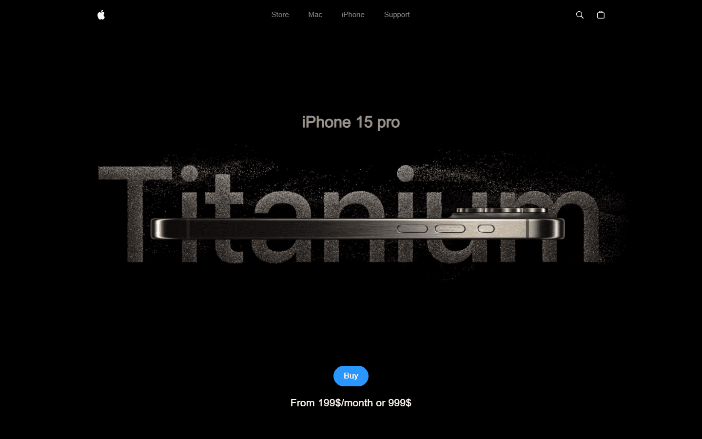
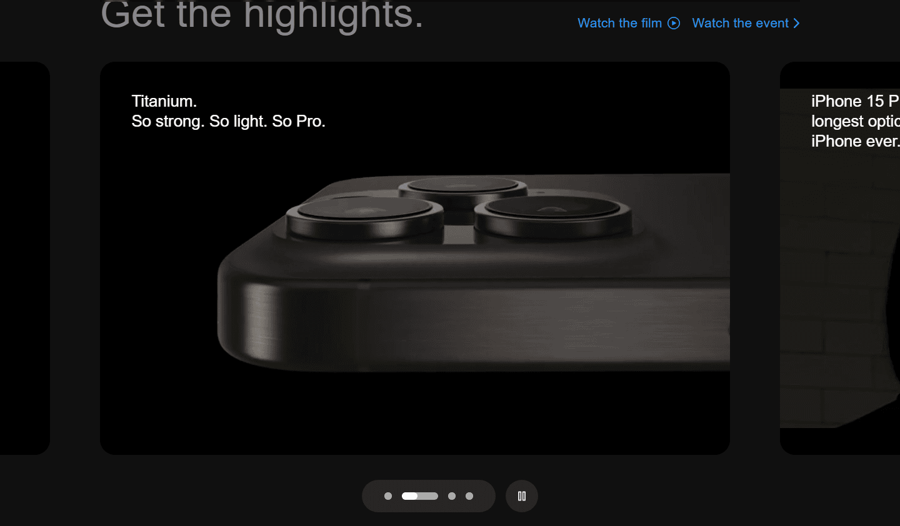
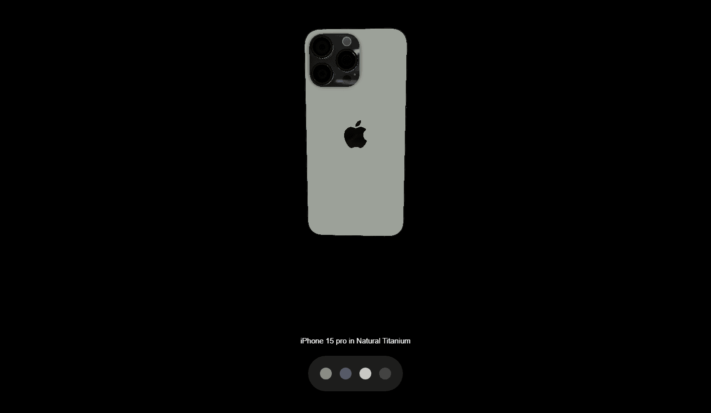
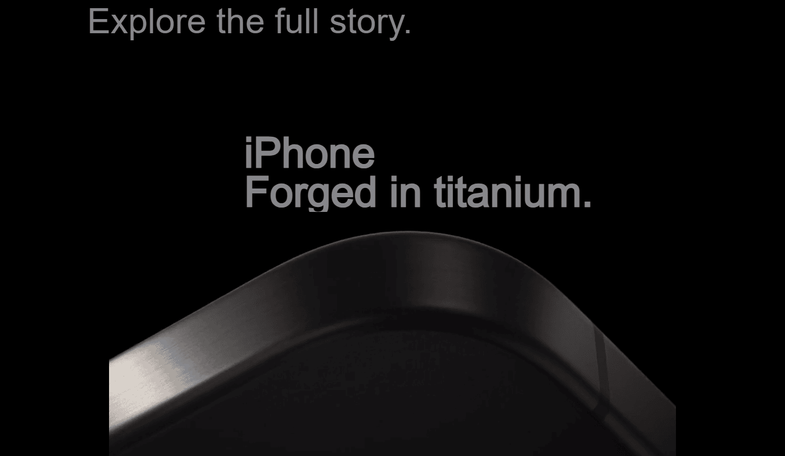
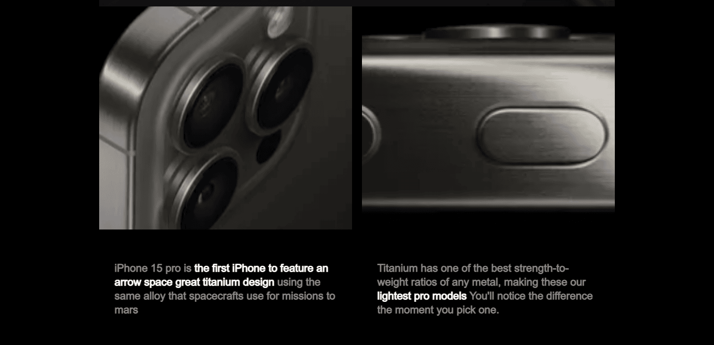
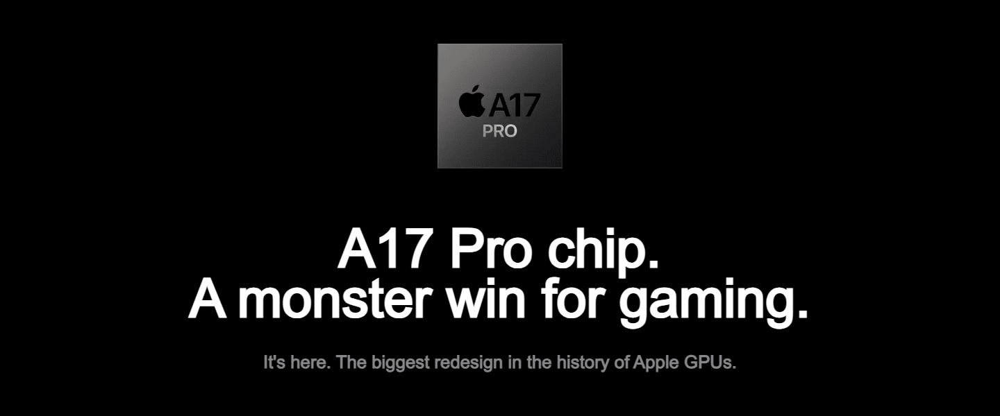
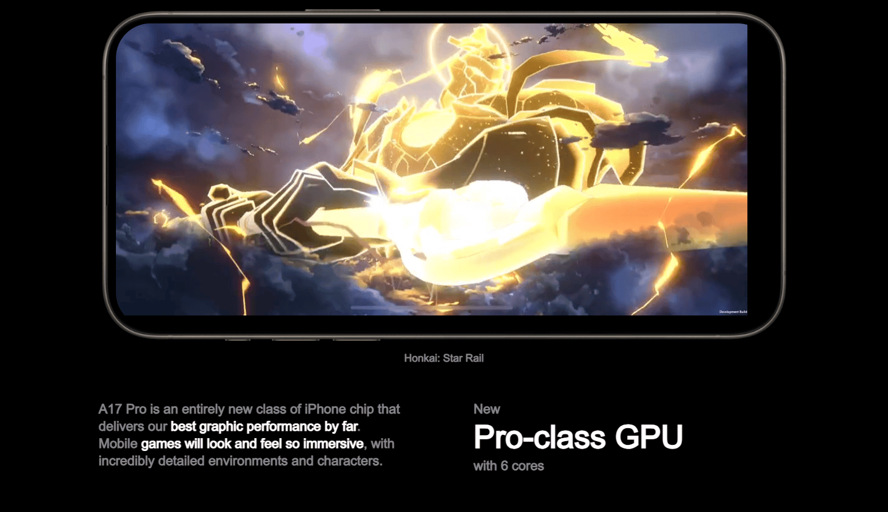
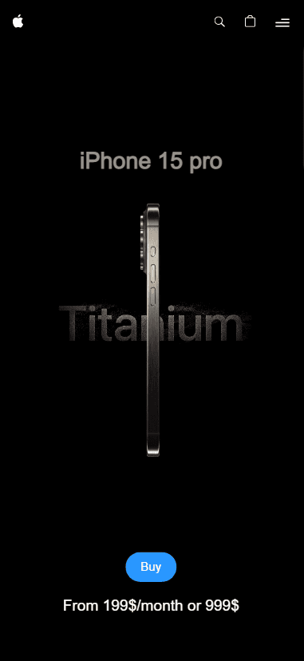

# 📱 iPhone 15

### iPhone 15 pro home page with stunning animations, videos and a 3D model to showcase the iPhone 15 pro.

## Link 🔗 [https://charactermi-iphone-15.vercel.app](https://charactermi-iphone-15.vercel.app)

 

# Preview

 

# Mobile Responsive

# Technologies

<ul>
    <li>
        
    </li>
    <li>
        
    </li>
    <li>
        
    </li>
    <li>
        
    </li>
    <li>
        
    </li>
    <li>
        
    </li>
    <li>
        
    </li>
    <li>
        
    </li>
</ul>
